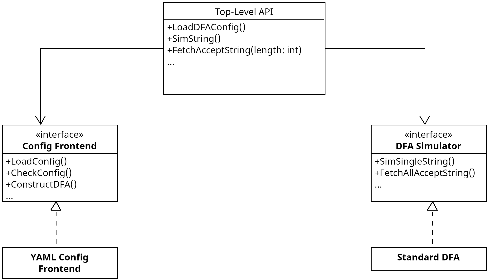

# 实验一设计

## 实验要求（用户需求）

**DFA模拟程序**

- DFA输入包括“字符集”、“状态集”、“开始状态”、“接受状态集”、“状态转换表；
- 上述输入的五元组保存在一个文本文件中，
- 对DFA进行检查，开始状态是否唯一，包含在状态集中，接受状态集是否为空，包含在状态集中，
- DFA的输出，输入待显示的字符串的最大长度N，输出以上定义的DFA的语言集中长度≤N的所有规则字符串；
- DFA的规则判定，输入（或用字符集随机生成）一个字符串，模拟DFA识别字符串的过程判定该字符串是否是规则字符串（属于DFA的语言集）；

## 架构设计

采用依赖倒置原则自顶向下设计。

提供给用户的顶层API接口包括：

- 加载DFA配置文件
- 模拟单一字符串
- 寻找所有符合规则的字符串

根据需求定义两个单一职责接口：

- Config Frontend：加载DFA配置文件，检查合法性并构造DFA数据模型
- DFA Simulator：模拟DFA的状态转换，检查字符串是否符合规则，寻找所有符合规则的字符串

架构如图所示：

