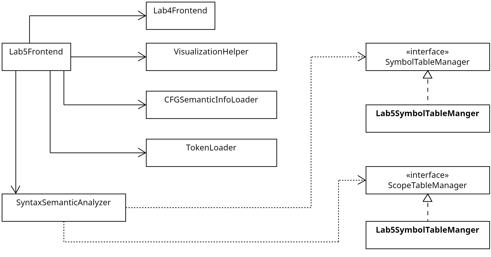

# 实验五设计

## 实验要求（用户需求）

目标：SLR引导的语义分析框架实现

输入：-SLR(1)分析表（实验四输出）嵌入语义动作的文法规则（文件或硬编码）
- Token流（实验二输出）

输出：- 抽象语法树（AST）的可视化表示，符号表（变量名、类型、作用域），语义错误报告（如类型错误）

要求：在SLR(1)语法分析的基础上，集成语义动作，构建抽象语法树（AST）并维护符号表，完成类型检查和初步语义验证。

额外信息：编译器只针对一个特定的文法。

```
P -> D' S' # 程序入口
D' -> epsilon | D' D; # 声明表
D -> T d | T d[i] | T d(A'){D' S'} # 单个声明
T -> int | float | void; # 类型
A' -> epsilon | A' A; # 形参表
A -> T d | T d[] | T d(T) # 单个形参
S' -> S | S' ; S # 语句表
S -> d = E | d[E] = E | if (B) S | if (B) S else S | while (B) S | return E | {S'} | d(R') # 语句
E -> num | flo | d | d[E] | E + E | E * E | (E) | d(R') # 常规算数表达式
B -> E r E | E # 布尔表达式
R' -> epsilon | R' R, # 实参表
R -> E | d[] | d() # 单个实参
```

## 实验设计

### 需求分析

在先前实验中已经完成了原始程序到token流的转换器，以及从CFG文法到SLR(1)分析表的生成。现在需要在次基础上实现语义分析功能。因此首先需要定义语义动作的结构。

对模型部分：
- 增加面向CFG的语义规则模型：
    - 在语法符号（终结符/非终结符）层面，预设计/定义一系列符号属性。准备的属性集合应该涵盖实验给出测试文法中所有可能的符号属性。
    - 在产生式层面，应该预定义一系列语义动作函数。根据每个AST节点的类型和属性，语义动作函数可以执行不同的操作。比如，对于一个变量声明产生式，可以有一个语义动作函数来处理变量的类型检查和符号表的更新。
    - 在设计语义规则时，应当尽量保证所有属性都是综合属性，即每个属性只依赖自身及其子节点的属性，而不依赖于父节点或兄弟节点的属性。否则AST的构建和遍历将会变得复杂，且难以维护。
- 增加符号及符号表模型：
    - 语义分析的最终输出是一个符号表，其是包含了所有符号的符合数据结构。符号表应该支持轻松的增删改查并能够帮助发现重复定义等错误。
    - 符号表的每个表项都是一个符号对象，其中所有的符号都包含一些共有属性，例如名称和类型等。除此之外，符号也可以根据符号类型包含其自定义属性。例如，函数拥有参数列表、返回值类型等属性。而数组（多维）则拥有维度个数、每个维度的长度等属性。符号在设计时也应该支持语义检查。比如某个声明产生式D -> T id在进行语义分析时，发现T的类型是int，而id的类型是float，则应该报错。
- 增加AST模型：
    - 抽象语法树（AST）是语义分析的核心数据结构。每个AST节点用一个CFG文法符号标识，同时根据产生式和父节点/子节点关系构建树结构。AST树模型在设计时就应当支持先根/后跟遍历、按顺序访问子节点（即一个节点符号对应的某个产生式）等操作。
    - 每个抽象语法树节点除了树形结构的基本连接关系和文法符号表示外，应当保存所有相关的符号属性。比如一个变量声明节点应该保存变量名、类型等属性，而一个函数调用节点应该保存函数名、实参列表等属性。同时，如果该节点在符号表中有对应的符号对象，应当使用某种方式和符号表中的符号对象关联起来，毕竟符号表的最重要作用就是方便中间代码生成遍历AST时查找符号。

对实现部分：
- 增加基于多栈PDA的SLR(1)-AST构建工具：
    - 这个工具也是语法分析工具，其会一边构建AST树一边进行语法分析。同时，它也几乎不具备语义分析功能。只是在AST树的节点上标明节点类型，方便后续的语义分析和中间代码生成。
- 增加语义分析器：
    - 假设AST树生成无误，就可以直接使用AST树进行语义分析。语义分析器需要遍历AST树，并根据每个节点的类型和属性执行相应的语义动作函数。它还需要维护符号表，并在遇到语义错误时生成错误报告。
- 语法/语义分析可视化工具：
    - 根据实验要求，需要提供一个可视化工具来展示AST树和符号表。这个工具可以帮助用户理解语法分析和语义分析的过程，并且能够直观地查看符号表中的内容。

所以整体语法分析-语义分析的过程是
1. 加载相关数据
2. 使用SLR(1)-AST构建工具解析token流，生成AST树（同时进行语法分析），其中语义信息除了节点类型外留空。
3. 使用语义分析器第二遍访问AST树，填充节点的语义信息，并维护符号表和作用域等相关信息。语义分析器还需要检查语义错误并生成错误报告。
4. 汇总各种数据结构并进行可视化展示。

### 关键数据模型设计

#### 目标CFG文法的增广语义规则设计

```
P -> D' S' # 程序入口
D' -> epsilon | D' D; # 声明表
D -> T d | T d[num] | T d(A'){D' S'} # 单个声明，分别是声明变量、数组和函数
T -> int | float | void # 类型
A' -> epsilon | A' A; # 形参表
A -> T d | T d[] | T d(T) # 单个形参，形参类型分别是基本类型、数组和函数
S' -> S | S' ; S # 语句表
S -> d = E | d[E] = E | if (B) S | if (B) S else S | while (B) S | return E | {S'} | d(R') # 语句
E -> num | flo | d | d[E] | E + E | E * E | (E) | d(R') # 常规算数表达式
B -> E r E | E # 布尔表达式
R' -> epsilon | R' R, # 实参表
R -> E | d[] | d() # 单个实参，分别是表达式运算结果、数组和函数调用
```

文法额外信息：

1. {S'}并不会分割作用域，主要配合if语句使用。在单独使用时让代码更加清晰，但没有实际语义作用。只有当在声明函数时才会分割作用域。
2. 所有“语句”表述默认指非声明语句。声明语句称为“声明”。

##### 属性设计

宗旨：

1. 所有属性都应当是综合属性，即每个属性只依赖于自身及其子节点的属性，而不依赖于父节点或兄弟节点的属性。
2. 属性设计应当尽可能分担语义分析和中间代码生成的工作量，避免重复计算。例如，如果能通过增加属性减少访问AST树节点的次数，则应当增加属性。理想情况下，语义分析只需要遍历一次AST树即可完成所有工作，每当访问到一个节点时，所有需要的信息都已经准备好了，中间代码生成同理。

为了清晰和可读性，一般情况下我们约定属性名和配置文件中规定的别名一致。

首先从始终位于AST树最底端的终结符开始。终结符的属性比较简单，只分为有具体值的终结符和没有具体值的终结符，前者多一个value属性，后者只有node_type属性。node_type属性同时也标明了AST树节点的类型。所有终结符属性显然符合继承属性要求。

*\*、+、=、\[、\]、\(、\)、\{、\}、;、,、if、else、while、return、int、float、void:*

- 属性1：node_type，词法分析类别。凡是词法分析中只有类型名而token流中不涉及具体值的终结符都可以使用该属性。比如`if`、`else`、`while`等。

*num、flo、d、r:*

- 属性1：node_type，值为一个字符串，就是其词法分析类别，示数据类型（int、float、void等），当遇到表达式时就可以用于语法检查了。
- 属性2：value，别名value，值为一个字符串（由于不知道代码生成后端的具体表示方式，因此这里使用字符串表示，后端可以根据需要转换为具体类型）。比如num的值为数字字符串，flo的值为浮点数字符串，d的值为变量名字符串，r的值为布尔运算（如`<`，`==`）字符串。

设计非终结符的属性：

*P——程序入口:*

程序入口节点是AST树的根节点，表示整个程序的起点。它无需往上传递任何属性。对它的操作也只需要通过访问子节点来完成。

- 属性1：node_type，固定为字符串`PROGRAM`，表示这是一个程序入口节点。
- 属性2：scope_id，别名scope_id，值为一个整数，表示该程序入口的作用域编号。这个属性标识了该程序入口的作用域，便于在符号表中查找和管理符号。

**特别约定：scope_id属性值为-1时代表尚未分配作用域编号，最外层的作用域编号为0。**

依赖分析：不需要分析。

结构体示例：

```cpp
struct ProgramNode {
    std::string node_type = "PROGRAM"; // 固定值
    int scope_id = 0; // 作用域编号
    // 每个属性都应该设置默认值，以避免未定义行为
};
```

*D'——声明表:*

声明表是一个声明集合，并且能够确定所有其中的声明作用域都是相同的。只有到了声明表阶段，才会开始真正的符号表和作用域的建立。

- 属性1：node_type，固定为字符串`DECL_LIST`，表示这是一个声明表节点。
- 属性2：decl_count，别名decl_count，值为一个整数，表示声明的个数。
- 属性3：declarations，别名declarations，是一个向量，包含每个声明节声明节点的定义。这个属性用于向上传递该声明部分所包含的所有声明，以建立每个声明的作用域。
- 属性4：scope_id，别名scope_id，值为一个整数，表示该声明表的作用域编号。这个属性标识了该声明表的作用域，便于在符号表中查找和管理符号。

依赖分析：仅依赖子节点的属性，因此符合继承属性要求。

结构体示例：

```cpp
struct DeclListNode {
    std::string node_type = "DECL_LIST"; // 固定值
    int decl_count = 0; // 声明个数
    std::vector<std::shared_ptr<DeclNode>> declarations; // 声明节点列表
    int scope_id = -1;
    // 每个属性都应该设置默认值，以避免未定义行为
};
```

*D——声明:*

声明节点需要提供类型、变量名、数组长度、形参表等信息。

- 属性1：node_type，固定前缀为`DECL_`，表示这是一个声明节点。后缀根据具体的声明类型而定，比如`DECL_VAR`、`DECL_ARRAY`、`DECL_FUNC`等。
    1. 对于变量声明，使用`DECL_VAR`，表示这是一个变量声明节点。
    2. 对于数组声明，使用`DECL_ARRAY`，表示这是一个数组声明节点。
    3. 对于函数声明，使用`DECL_FUNC`，表示这是一个函数声明节点。
- 属性2：data_type，直接由T决定，即变量类型或函数返回值。
- 属性3：var_name，别名var_name，值为一个字符串，表示该声明的变量名（如果是数组或函数，则为对应的名称）。
- 属性4：array_length，别名array_length，值为一个整数，表示该数组的长度（如果是数组声明）。如果不是数组声明，则该属性无效。
- 属性5：arg_list，别名arg_list，是一个ArgListNode对象，表示该函数的形参表（如果是函数声明）。如果不是函数声明，则该属性无效。
- 属性6：function_sub_scope，别名function_sub_scope，是一个整数，表示该函数声明的子作用域编号（如果是函数声明）。如果不是函数声明，则该属性无效。
- 属性7：scope_id，别名scope_id，值为一个整数，表示该声明的作用域编号。这个属性标识了该声明的作用域，便于在符号表中查找和管理符号。

依赖分析：node_type依赖于自身的属性，data_type、var_name、array_length、arg_list依赖于子节点的属性。显然一个变量/函数/数组在使用前必须先声明，因此语法正确的情况下其一定在符号表中有对应的符号对象。因此符合继承属性要求。

结构体示例：

```cpp
struct DeclNode {
    std::string node_type = ""; // 声明类型，前缀为"DECL_"
    std::string data_type = ""; // 数据类型，可能是"int"、"float"等
    std::string var_name = ""; // 变量名
    std::optional<int> array_length = 0; // 数组长度，仅在声明是数组时有效
    std::optional<ArgListNode> arg_list; // 形参表，仅在声明是函数时有效
    std::optional<int> function_sub_scope = 0; // 函数子作用域编号，仅在声明是函数时有效
    int scope_id = -1; // 作用域编号
    // 每个属性都应该设置默认值，以避免未定义行为
};
```

*T——类型名:*

- 属性1：node_type，固定为字符串`TYPE`，表示这是一个类型名节点。
- 属性2：data_type，别名data_type，值为一个字符串，表示该类型的具体数据类型（num-对应int、flo-对应float等）。
    1. 对各个基本类型，直接使用其词法分析类别作为data_type的值，比如INT，FLOAT、VOID等。

依赖分析：仅依赖自身的属性，因此符合继承属性要求。

结构体示例：

```cpp
struct TypeNode {
    std::string node_type = "TYPE"; // 固定值
    std::string data_type = ""; // 数据类型，可能是"int"、"float"等
    // 每个属性都应该设置默认值，以避免未定义行为
};
```

*A'——形参表:*

需要提供形参的个数、每个形参的类型、变量名、数据类型等信息。

- 属性1：node_type，固定为字符串`ARG_LIST`，表示这是一个形参表节点。
- 属性2：arg_count，别名arg_count，值为一个整数，表示形参的个数。
- 属性3：arg_info，别名arg_info，是一个向量，包含每个形参的详细信息。每个形参信息是一个ArgNode对象，包含了形参的类型、数据类型、变量名等。用于语义检查和语义分析形参声明时的类型检查等。

依赖分析：仅依赖子节点的属性，因此符合继承属性要求。

结构体示例：

```cpp
struct ArgListNode {
    std::string node_type = "ARG_LIST"; // 固定值
    int arg_count = 0; // 形参个数
    std::vector<shared_ptr<ArgNode>> arg_info; // 形参信息列表
    // 每个属性都应该设置默认值，以避免未定义行为
};
```

*A——形参:*

形参需要提供数据类型、传入的变量类型以及要在函数中用到的变量名等信息。

- 属性1：node_type，固定前缀为`ARG_`，表示这是一个形参节点。后缀根据具体的形参类型而定，比如`ARG_VAR`、`ARG_ARRAY`等。
    1. 对于常规变量，使用`ARG_VAR`，表示这是一个变量形参节点。
    2. 对于数组元素，使用`ARG_ARRAY`，表示这是一个数组元素形参节点。
    3. 对于函数调用，使用`ARG_FUNC`，表示这是一个函数调用形参节点。
- 属性2：data_type，别名data_type，值为一个字符串，表示该形参的数据类型（num-对应int、flo-对应float等）。这个类型是由T节点提供的。
- 属性3：var_name，别名var_name，值为一个字符串，表示该形参的变量名（如果是数组或函数调用，则为对应的名称）。

依赖分析：node_type依赖于自身的属性，data_type和var_name依赖于子节点的属性。显然一个变量/函数/数组在使用前必须先声明，因此语法正确的情况下其一定在符号表中有对应的符号对象。因此符合继承属性要求。

结构体示例：

```cpp
struct ArgNode {
    std::string node_type = ""; // 形参类型，前缀为"ARG_"
    std::string data_type = ""; // 数据类型，可能是"int"、"float"等
    std::string var_name = ""; // 变量名
    // 每个属性都应该设置默认值，以避免未定义行为
};
```

*S'——语句表:*

语句表是一个非声明语句语句集合，并且能够确定所有其中的语句作用域都是相同的。

- 属性1：node_type，固定为字符串`STAT_LIST`，表示这是一个语句表节点。
- 属性2：scope_id，别名scope_id，值为一个整数，表示该语句表的作用域编号。这个属性标识了该语句表的作用域，便于在符号表中查找和管理符号。

依赖分析：仅依赖子节点的属性，因此符合继承属性要求。

结构体示例：

```cpp
struct StatListNode {
    std::string node_type = "STAT_LIST"; // 固定值
    int scope_id = -1; // 作用域编号
    // 每个属性都应该设置默认值，以避免未定义行为
};
```

*S——语句:*

语句节点需要提供：
1. 节点类型（语句类型），方便语义分析和中间代码生成调用合适的处理函数。
2. 语句的变量依赖列表。这个列表包含该节点及其所有子节点所依赖的变量名列表。这个属性会层层向上从传递并增长，直到S'语句节点。这样就能确定一个作用域内所有需要的变量名。

- 属性1：node_type，固定前缀为`STAT_`，表示这是一个语句节点。后缀根据具体的语句类型而定.
    1. 对赋值语句，使用`STAT_ASSIGN`，表示这是一个赋值语句节点。
    2. 对数组元素赋值语句，使用`STAT_ARRAY_ASSIGN`，表示这是一个数组元素赋值语句节点。
    3. 对if语句，使用`STAT_IF`，表示这是一个if语句节点。
    4. 对if-else语句，使用`STAT_IF_ELSE`，表示这是一个if-else语句节点。
    5. 对while语句，使用`STAT_WHILE`，表示这是一个while语句节点。
    6. 对return语句，使用`STAT_RETURN`，表示这是一个return语句节点。
    7. 对复合语句（即{S'}），使用`STAT_COMPOUND`，表示这是一个复合语句节点。
    8. 对函数调用语句（即d(R')），使用`STAT_FUNC_CALL`，表示这是一个函数调用语句节点。
- 属性：scope_id，别名scope_id，值为一个整数，表示该语句的作用域编号。这个属性标识了该语句的作用域，便于在符号表中查找和管理符号。

依赖分析：node_type依赖于自身的属性，显然一个变量/函数/数组在使用前必须先声明，因此语法正确的情况下其一定在符号表中有对应的符号对象。因此符合继承属性要求。

结构体示例：

```cpp
struct StatNode {
    std::string node_type = ""; // 语句类型，前缀为"STAT_"
    int scope_id = -1; // 作用域编号
    // 每个属性都应该设置默认值，以避免未定义行为
};
```

*E——表达式运算结果:*

表达式运算结果包含多个候选式，因此应该为语义分析和中间代码生成提供足够的信息，比如通过节点类别指示应该调用哪个语义动作函数，以及表达式的计算结果等。

- 属性1：node_type，固定前缀为`EXPR_`，表示这是一个表达式节点。后缀根据具体的表达式类型而定，比如`EXPR_NUM`、`EXPR_VAR`等。
    1. 对直接常量，使用`EXPR_CONST`，表示这是一个常量表达式节点。
    2. 对常规变量，使用`EXPR_VAR`，表示这是一个变量表达式节点。
    3. 对数组元素，使用`EXPR_ARRAY`，表示这是一个数组元素表达式节点。
    4. 对函数调用，使用`EXPR_FUNC`，表示这是一个函数调用表达式节点。
    5. 对算术运算，使用`EXPR_ARITH_NOCONST`，表示这是一个算术运算表达式节点并且值不固定。如果表达式两侧都是常量，则化简为`EXPR_CONST`。
    6. 对括号表达式，使用`EXPR_PAREN_NOCONST`，表示这是一个括号表达式节点。同样，如果括号内的表达式是常量，则化简为`EXPR_CONST`。
- 属性2：data_type，别名data_type，值为一个字符串，表示该表达式的计算结果的数据类型（num-对应int、flo-对应float等）。
    1. 对于常量表达式，直接使用其词法分析类别作为data_type的值，比如INT、FLOAT等。
    2. 对于其他情况，data_type无效。

- 属性3：value，别名value，值为一个字符串（由于不知道代码生成后端的具体表示方式，因此这里使用字符串表示，后端可以根据需要转换为具体类型）。当且仅当表达式是常量表达式时，value才有意义。比如num的值为数字字符串，flo的值为浮点数字符串。
- 属性：scope_id，别名scope_id，值为一个整数，表示该表达式的作用域编号。这个属性标识了该表达式的作用域，便于在符号表中查找和管理符号。

依赖分析：仅依赖子节点的属性，因此符合继承属性要求。

结构体示例：

```cpp
struct ExprNode {
    std::string node_type = ""; // 表达式类型，前缀为"EXPR_"
    std::string data_type = ""; // 数据类型，可能是"int"、"float"等
    std::optional<std::string> value = ""; // 表达式值，仅在常量表达式时有效
    // 每个属性都应该设置默认值，以避免未定义行为
    int scope_id = -1; // 作用域编号
};
```

*B——布尔表达式:*

由于布尔表达式规定了类型必须为布尔，因此一个节点属性可以同时表示布尔表达式的类型和计算结果。

- 属性1：node_type，固定前缀为`BOOL_`，表示这是一个布尔表达式节点。后缀根据具体的布尔表达式类型而定。
    1. 对于布尔运算，使用`BOOL_OP`，表示这是一个布尔运算表达式节点。
    2. 对于单个表达式，使用`BOOL_EXPR`，表示这是一个单个表达式布尔节点。
- 属性2：scope_id，别名scope_id，值为一个整数，表示该布尔表达式的作用域编号。这个属性标识了该布尔表达式的作用域，便于在符号表中查找和管理符号。

依赖分析：仅依赖子节点的属性，因此符合继承属性要求。

结构体示例：

```cpp
struct BoolNode {
    std::string node_type = ""; // 布尔表达式类型，前缀为"BOOL_"
    int scope_id = -1; // 作用域编号
    // 每个属性都应该设置默认值，以避免未定义行为
};
```

*R——实参:*

显然对于语义分析和中间代码生成，在遇到实参的时候，需要知道其是常量还是变量，以及其数据类型等。

- 属性1：node_type，固定前缀为`RARG_`，表示这是一个实参节点。后缀根据具体的实参类型而定，比如`RARG_EXPR`、`RARG_VAR`等。
    1. 对表达式运算结果，使用`RARG_EXPR`，表示这是一个表达式实参节点。
    2. 对数组元素，使用`RARG_ARRAY`，表示这是一个数组元素实参节点。
    3. 对函数调用，使用`RARG_FUNC`，表示这是一个函数调用实参节点。
- 属性2：data_type，别名data_type，值为一个字符串，表示该实参的数据类型（num-对应int、flo-对应float等）。
    1. 对于表达式实参，直接使用其词法分析类别作为data_type的值，比如INT、FLOAT等。
    2. 对于其他情况，要从符号表中查找对应的符号对象，获取其数据类型。
- 属性3：var_name，别名var_name，值为一个字符串，表示该实参的变量名（如果是数组或函数调用，则为对应的名称）。当且仅当实参是变量或数组时，var_name才有意义。其他情况下中间代码生成器将会访问表达式来进一步获取数据。
- 属性4：scope_id，别名scope_id，值为一个整数，表示该实参的作用域编号。这个属性标识了该实参的作用域，便于在符号表中查找和管理符号。

依赖分析：node_type依赖于自身的属性，data_type依赖于子节点的属性和符号表。显然一个变量/函数/数组在使用前必须先声明，因此语法正确的情况下其一定在符号表中有对应的符号对象。因此符合继承属性要求。

结构体示例：

```cpp
struct RealArgNode {
    std::string node_type = ""; // 实参类型，前缀为"ARG_"
    std::string data_type = ""; // 数据类型，可能是"int"、"float"等
    std::optional<std::string> var_name = ""; // 变量名，仅在实参是变量或数组时有效
    int scope_id = -1; // 作用域编号
    // 每个属性都应该设置默认值，以避免未定义行为
};
```

*R'——实参表:*

从语义检查的角度，实参表应当标出实参的个数、每个实参的类型等信息。

- 属性1：node_type，固定为字符串`RARG_LIST`，表示这是一个实参表节点。
- 属性2：arg_count，别名arg_count，值为一个整数，表示实参的个数。
- 属性3：arg_info，别名arg_info，是一个向量，包含每个实参的详细信息。每个实参信息是一个ArgNode对象，包含了实参的类型、数据类型、变量名等。主要用于语义检查，在中间代码生成时还是会通过访问AST树节点来获取实参信息。
- 属性4：scope_id，别名scope_id，值为一个整数，表示该实参表的作用域编号。这个属性标识了该实参表的作用域，便于在符号表中查找和管理符号。

依赖分析：仅依赖子节点的属性，因此符合继承属性要求。

结构体示例：

```cpp
struct RealArgListNode {
    std::string node_type = "REAL_ARG_LIST"; // 固定值
    int arg_count = 0; // 实参个数
    std::vector<std::shared_ptr<ArgNode>> arg_info; // 实参信息列表
    scope_id = -1; // 作用域编号
    // 每个属性都应该设置默认值，以避免未定义行为
};
```

##### 符号表设计

符号表由一系列符号对象组成，这些符号有一些共有属性，但同时也有各自的特有属性。符号表的设计应当能够支持符号的增删改查操作，并且能够根据作用域进行分层管理。

首先对每个符号对象的共有属性进行设计：

1. 符号名（symbol_name）：一个字符串，表示符号的名称。
2. 符号类型（symbol_type）：一个枚举类型，表示符号的类型。可以是变量、数组、函数等。
3. 作用域id（scope_id）：一个整数，表示符号所在的作用域编号。这个编号用于标识符号的作用域，便于在符号表中查找和管理符号。
4. 数据类型（data_type）：一个字符串，表示符号的数据类型（如int、float等）。对于函数符号，这个属性表示函数的返回值类型。对于数组符号，这个属性表示数组元素的类型。
5. 抽象内存大小（memory_size）：相对于某个最小单元，如字长，的内存大小。对于函数符号，这*不包含*函数体的内存区间。对于数组符号，这个属性表示数组元素在内存中的起始地址和结束地址。

之后对不同符号对象的特有属性进行设计：
*变量符号（VariableSymbol）：*
（无特有属性，直接使用共有属性即可。）

*数组符号（ArraySymbol）：*
1. 数组长度（array_length）：一个整数，表示数组的长度。

*函数符号（FunctionSymbol）：*
1. 形参列表（arg_list）：一个向量，包含每个形参的详细信息。每个形参信息是一个ArgNode对象，包含了形参的类型、数据类型、变量名等。
2. 直接子作用域（direct_child_scope）：一个整数，表示该函数的直接子作用域（也就是函数体的作用域）编号。这个编号用于标识函数的直接子作用域，便于在符号表中查找和管理符号。

其结构体示例如下：

```cpp
struct SymbolEntry {
    std::string symbol_name; // 符号名
    SymbolType symbol_type; // 符号类型
    int scope_id; // 作用域id
    std::string data_type; // 数据类型
    int memory_size; // 抽象内存大小（相对于最小内存单元）
    
    // 可选特殊属性
    std::optional<int> array_length; // 数组长度，仅对数组符号有效
    std::optional<std::vector<ArgNode>> arg_list; // 形参列表，仅对函数符号有效
    std::optional<int> direct_child_scope; // 直接子作用域，仅对函数符号有效
};

同时，我们从顶层语义分析要求的角度考虑，定义两个符号相同当且仅当：其名称相同，且其作用域id相同。这样就能确保在同一作用域内不会出现同名符号。

因此符号表可以使用一个集合来表示，由于实验有可视化要求，可以将set的顺序设置为符号的作用域id和符号名的字典序，为后续的可视化提供方便。同时，符号表应该支持添加符号，判断符号是否存在（专用于语义检查）和查找符号（专用于中间代码生成）等操作。

符号表的声明如下：
```cpp
class SymbolTable {
public:
    // 添加符号到符号表
    void addSymbol(const Symbol& symbol);

    // 判断符号是否存在
    bool symbolExists(const std::string& symbol_name, int scope_id) const;

    // 查找某个作用域内的某个符号，包括形参
    std::optional<Symbol> findSymbolInScope(const std::string& symbol_name, int scope_id) const;

    // 递归链式查询某个符号在所有作用域中的定义
    std::optional<Symbol> findSymbolInAllScopes(const std::string& symbol_name) const;

    // 获取当前作用域的符号列表（注意：如果在函数体内，还要包括函数形参）
    std::vector<Symbol> getAllSymbolsInScope(int scope_id) const;

private:
    // 符号表使用set存储符号，按作用域id和符号名的字典序排序
    std::set<Symbol> symbols;
};
```

##### 作用域表设计

作用域表的作用是管理符号的作用域信息，其采用栈来模拟作用域的嵌套关系。每个作用域都有一个唯一的作用域编号（scope_id），并且可以包含多个符号。

作用域表的功能应该包括：
1. 重置/初始化：清空栈等信息，从约定的最外层作用域0开始。
2. 进入新作用域：当遇到一个新的作用域时（如函数体等），先通过计数器生成一个新的作用域编号，然后将该编号入栈，并更新作用域之间的父子关系。
3. 退出当前作用域：当离开一个作用域时，将当前作用域编号出栈，并恢复到上一个作用域。
4. 查询直接子作用域：给定一个作用域编号，查询其直接子作用域编号列表。
5. 查询直接父作用域：给定一个作用域编号，查询其直接父作用域编号。
6. 查询当前作用域：获取当前作用域编号，也就是栈顶的作用域编号。

因此，其需要以下基本属性：
1. 作用域id计数器（scope_id_counter）：一个整数，表示当前作用域id的计数器。每次进入新作用域时递增。
2. 作用域栈（scope_stack）：一个向量，存储当前作用域的编号。每次进入新作用域时将新的作用域编号入栈，每次退出当前作用域时将当前作用域编号出栈。
3. 子作用域表（child_scope_map）：一个映射，键为父作用域编号，值为一个向量，存储该父作用域的直接子作用域编号。用于快速查询直接子作用域。
4. 父作用域表（parent_scope_map）：一个映射，键为子作用域编号，值为父作用域编号。用于快速查询直接父作用域。

因此，作用域表的声明如下：

```cpp
class ScopeTable {
public:
    // 重置作用域表
    void reset();

    // 进入新作用域，返回新的作用域编号
    void enterNewScope();

    // 退出当前作用域，返回上一个作用域编号
    void exitCurrentScope();

    // 查询直接子作用域
    std::vector<int> getDirectChildScopes(int scope_id) const;

    // 查询直接父作用域
    int getDirectParentScope(int scope_id) const;

    // 获取当前作用域编号
    int getCurrentScope() const;
private:
    int scope_id_counter; // 作用域id计数器
    std::vector<int> scope_stack; // 作用域栈
    std::unordered_map<int, std::vector<int>> child_scope_map; // 子作用域表
    std::unordered_map<int, int> parent_scope_map; // 父作用域表
};
```

##### 语义动作函数设计

为了充分利用C++的多态性，首先约定**上述所有节点类型都是从一个基础结构体`ASTNodeContent`派生而来**。这个基类包含两个纯虚函数：

1. `subnode_takein(std::vector<std::shared_ptr<ASTNodeContent>> subnodes)`：用于接收子节点，并将其存储在一个向量中。这个函数会在每个具体的节点类中实现，以便于处理不同类型的子节点。使用指针来实现同一个列表中可以存储不同类型的节点。理论上来说，可以完全不依赖这个函数。但是由于树形结构是由`tree`库来管理的，如果每次都去调用其方法访问子节点会增加不必要的耦合和复杂度，因此这个方法的本质是创造一个清晰的子节点缓存，让语义动作执行完全在`ASTNodeContent`的子类中进行，而不是依赖于`tree`库的接口。
2. `semantic_action(int scope_id, std::shared_ptr<SymbolTable> symbol_table, std::shared_ptr<ScopeTable> scope_table)`：用于执行语义动作。这个函数会在每个具体的节点类中实现，以便于执行特定的语义检查和中间代码生成。

此外，我们要求节点在构建时必须传入一个`node_type`参数，用于标识节点的类型。这个参数会在构造函数中设置，并且在`subnode_takein`和`semantic_action`函数中使用。这是一定可以做到的，因为产生式一旦确定了，节点类型就已经是固定的了。其中一个特例是E的常量折叠情况，在不知道是否可以将表达式折叠为常量时，可以先创建一个`EXPR_NOCONST`类型的节点，等到语义分析阶段再进行常量折叠。（理论上如果设计完善，即使不折叠也可以正常生成中间代码）

最后，由于有可视化要求，所有的节点类型都应该能够转换为一个字符串表示形式，以便于在可视化工具中展示。因此要能将每个节点类型转换为一个字符串，表示其中的信息

因此，`ASTNodeContent`的定义如下：

```cpp
struct ASTNodeContent {
    std::string node_type; // 节点类型，用于标识节点的类型
    std::vector<std::shared_ptr<ASTNodeContent>> subnodes; // 子节点列表

    // 接收子节点
    virtual void subnode_takein(std::vector<std::shared_ptr<ASTNodeContent>> subnodes) = 0;

    // 执行语义动作
    virtual void semantic_action(int scope_id, std::shared_ptr<SymbolTable> symbol_table, std::shared_ptr<ScopeTable> scope_table) = 0;

    // 将节点转换为字符串表示形式
    virtual std::string to_string() const = 0;

    virtual ~ASTNodeContent() = default; // 虚析构函数，确保派生类正确析构
};
```

值得注意的是该定义并不包含树形结构的基本要素，如父节点指针等。这是因为我决定把维护树形结构的复杂度分担到一个开源C++树形库tree中，减少不必要的错误和复杂度。tree库提供了树形结构的基本操作，如添加子节点、删除子节点等，因此我们可以直接使用它来管理AST树的结构。

接下来开始对每个节点的每个细分类型的语义动作函数进行设计，此处只给出自然语言描述。

**此处的语义动作指的是回溯时执行的语义动作函数，在进入该节点时的作用域移入等操作会在后文的作用域管理部分进行设计。也就是，执行语义动作函数时所有子节点的作用域已经确定了。**

```
P -> D' S' # 程序入口
D' -> epsilon | D' D; # 声明表
D -> T d | T d[num] | T d(A'){D' S'} # 单个声明，分别是声明变量、数组和函数
T -> int | float | void # 类型
A' -> epsilon | A' A; # 形参表
A -> T d | T d[] | T d(T) # 单个形参，形参类型分别是基本类型、数组和函数
S' -> S | S' ; S # 语句表
S -> d = E | d[E] = E | if (B) S | if (B) S else S | while (B) S | return E | {S'} | d(R') # 语句
E -> num | flo | d | d[E] | E + E | E * E | (E) | d(R') # 常规算数表达式
B -> E r E | E # 布尔表达式
R' -> epsilon | R' R, # 实参表
R -> E | d[] | d() # 单个实参，分别是表达式运算结果、数组和函数调用
```

*P——程序:*

当开始处理P的语义动作时，整个语义分析已经几乎完成了。此刻P应该检查一些属于整个最外层程序的特殊属性。

1. 确认是否有主函数（main函数，且位于作用域0），如果没有则抛出语义错误，表示缺少主函数。
2. 确认主函数的返回类型是否为int，如果不是则抛出语义错误，表示主函数返回类型错误。
3. 确认主函数的形参个数是否为0，如果不是则抛出语义错误，表示主函数形参个数错误。

*D'——声明表:*

声明表实际上也是一个容器，包含了所有的声明，因此无需提供语义动作函数。它的作用是将所有声明节点收集起来，便于后续的语义分析和中间代码生成。

*D——声明:*

声明节点是真正将声明信息传递给符号表的地方，因此需要提供语义动作函数。其语义动作函数的作用是将当前声明的信息添加到符号表中，并进行必要的语义检查。

1. 从子节点T获取数据类型（data_type）。
2. 检查数据类型是否是当前node_type可声明的类型，比如不允许有void类型的数组。
3. 从子节点d获取变量名（var_name）。
4. 如果是普通变量声明（T d），则创建一个变量符号对象，并添加到符号表中。
5. 如果是数组声明（T d\[num\]），则创建一个数组符号对象，并添加到符号表中，同时设置数组长度。其内存大小由数组长度和数据类型决定。
6. 如果是函数声明（T d(A'){D' S'}），则创建一个函数符号对象，并添加到符号表中，同时设置形参列表和直接子作用域编号。随后，将所有的形参添加到符号表中，并设置作用域编号为当前函数的作用域编号，其抽线内存大小均为一个内存地址的大小。比如如果实参最终传入了一个数组，则生成代码时要通过数组的首地址来访问实参在内存中的位置。
7. 如果上述添加时发现符号表中已经存在同名符号，则抛出语义错误，表示重复声明。

*T——类型名:*

将直接子节点的node_type作为数据类型（data_type）传递给声明节点的语义动作函数。

*A'——形参表:*

A' -> epsilon | A' A;

形参表只需维护形参的个数和详细信息，因此其语义动作函数的作用是将所有形参的信息收集起来，届时提供给函数声明的语义动作函数。

1. 如果没有子节点，对应A' -> epsilon，则初始化形参个数为0，形参信息为空。
2. 如果有子节点，则将子节点A'的形参信息添加到形参表中，并设置形参个数为相同。然后将子节点A的形参信息添加到形参表中，并递增形参个数。

*A——形参:*

1. 从子节点T获取数据类型（data_type）。
2. 从子节点d获取变量名（var_name）。
3. 检查数据类型是否是当前node_type可声明的类型，比如不允许有void类型的常规变量/数组形参。

*S'——语句表:*

语句表实际上也是一个容器，包含了所有的语句，因此无需提供语义动作函数。它的作用是将所有语句节点收集起来，便于后续的语义分析和中间代码生成。

*S——语句:*

在根据node_type确定语句类型后，语义动作函数的作用是将所有语句的信息收集起来，便于后续的语义分析和中间代码生成。

分情况讨论：
1. 如果类型是`STAT_ASSIGN`
    - 从子节点获取变量名
    - 检查变量名是否在符号表中存在，如果不存在则抛出语义错误，表示未声明的变量。如果在，取到其数据类型。
    - 检查符号类型是否与语句类型相一致，比如不能给函数或数组赋值。
    - 检查数据类型是否与表达式的计算结果数据类型相一致，如果不一致则抛出语义错误，表示类型不匹配。
2. 如果类型是`STAT_ARRAY_ASSIGN`
    - 从子节点获取变量名和数组下标表达式。
    - 检查变量名是否在符号表中存在，如果不存在则抛出语义错误，表示未声明的数组。如果在，取到其数据类型。
    - 检查符号类型是否为数组类型，如果不是则抛出语义错误，表示类型不匹配。
    - 检查数组下标表达式的计算结果数据类型是否为整数，如果不是则抛出语义错误，表示下标类型不匹配。
    - 检查数据类型是否与表达式的计算结果数据类型相一致，如果不一致则抛出语义错误，表示类型不匹配。
3. 如果类型是`STAT_IF`
    - 从子节点获取布尔表达式（事实上，只要确认有这个布尔表达式就行了，因为布尔表达式也会检查其是否能进行布尔运算）
4. 如果类型是`STAT_IF_ELSE`
    - 从子节点获取布尔表达式和两个语句表。结束。
5. 如果类型是`STAT_WHILE`
    - 从子节点获取布尔表达式，同上。
6. 如果类型是`STAT_RETURN`
    - 从子节点获取返回值表达式。
    - 在作用域表中查找直接父作用域ID。
    - 如果父作用域ID为-1，则抛出语义错误，表示return语句只能在函数体内使用。
    - 在符号表中查找直接子作用域ID对应的函数符号对象。
    - 检查函数符号对象的返回值类型是否与返回值表达式的计算结果数据类型相一致，如果不一致则抛出语义错误，表示类型不匹配。
7. 如果类型是`STAT_COMPOUND`
    - 无需处理，因为复合语句的作用域已经在进入该语句时设置好了。
8. 如果类型是`STAT_FUNC_CALL`
    - 从子节点获取函数名和实参表。
    - 在符号表中查找函数符号对象，如果不存在则抛出语义错误，表示未声明的函数。
    - 检查函数符号对象的形参个数是否与实参表中的实参个数相一致，如果不一致则抛出语义错误，表示实参个数不匹配。
    - 检查每个实参的类型是否与形参的类型相一致，如果不一致则抛出语义错误，表示实参类型不匹配。

*E——表达式:*

还是分情况讨论：
1. 如果类型是`EXPR_CONST`
    - 从子节点获取常量值和数据类型。
    - 将data_type和value设置到当前节点的属性中。
2. 如果类型是`EXPR_VAR`
    - 从子节点获取变量名。
    - 在符号表中查找变量符号对象，如果不存在则抛出语义错误，表示未声明的变量。
    - 将data_type设置为符号对象的数据类型。
3. 如果类型是`EXPR_ARRAY`
    - 从子节点获取数组名和下标表达式。
    - 在符号表中查找数组符号对象，如果不存在则抛出语义错误，表示未声明的数组。
    - 检查下标表达式的计算结果数据类型是否为整数，如果不是则抛出语义错误，表示下标类型不匹配。
    - 将data_type设置为数组元素的数据类型。
4. 如果类型是`EXPR_FUNC`（和S的处理方式类似）
    - 从子节点获取函数名和实参表。
    - 在符号表中查找函数符号对象，如果不存在则抛出语义错误，表示未声明的函数。
    - 检查函数符号对象的形参个数是否与实参表中的实参个数相一致，如果不一致则抛出语义错误，表示实参个数不匹配。
    - 检查每个实参的类型是否与形参的类型相一致，如果不一致则抛出语义错误，表示实参类型不匹配。
    - 将data_type设置为函数符号对象的返回值类型。
5. 如果类型是`EXPR_ARITH_NOCONST`（注意：此时需要尝试常量折叠）
    - 从子节点获取左侧和右侧表达式。
    - 检查左右侧表达式结果类型是否一致，如果不一致则抛出语义错误，表示类型不匹配。
    - 检查左右侧表达式的计算结果数据类型是否为整数或浮点数，如果不是则抛出语义错误，因为没法计算void类型的表达式。
    - 如果左右侧表达式都是常量，则进行常量折叠，计算结果并将data_type和value设置到当前节点的属性中。同时，修改当前节点的node_type为`EXPR_CONST`。
    - 如果有任意一个表达式不是常量，则将data_type设置为左右侧表达式的计算结果数据类型，并将node_type保持为`EXPR_ARITH_NOCONST`。
6. 如果类型是`EXPR_PAREN_NOCONST`
    - 从子节点获取括号内的表达式。
    - 检查其计算结果是否为常量，如果是，则进行常量折叠，计算结果并将data_type和value设置到当前节点的属性中。同时，修改当前节点的node_type为`EXPR_CONST`。
    - 如果不是常量，则将data_type设置为括号内表达式的计算结果数据类型，并将node_type保持为`EXPR_PAREN_NOCONST`。

*B——布尔表达式:*

1. 如果是BOOL_EXPR，获取子节点的表达式类型值。检查其是否为整数。如果不是整数，则抛出语义错误，表示布尔表达式必须是整数类型。
2. 如果是BOOL_OP，获取子节点的左侧和右侧表达式。检查它们计算结果是否均为整数。

*R'——实参表:*

实参表的语义动作函数的作用是将所有实参的信息收集起来，届时提供给函数调用的语义动作函数。
1. 如果没有子节点，对应R' -> epsilon，则初始化实参个数为0，实参信息为空。
2. 如果有子节点，则将子节点R'的实参信息添加到实参表中，并设置实参个数为相同。然后将子节点R的实参信息添加到实参表中，并递增实参个数。

*R——实参:*

1. 如果类型是`ARG_EXPR`
    - 从子节点获取表达式。
    - 将data_type设置为表达式的计算结果数据类型。
2. 如果是`ARG_ARRAY`
    - 从子节点获取数组名和下标表达式。
    - 在符号表中查找数组符号对象，如果不存在则抛出语义错误，表示未声明的数组。
    - 将data_type设置为数组元素的数据类型。
3. 如果是`ARG_FUNC`
    - 从子节点获取函数名和实参表。
    - 在符号表中查找函数符号对象，如果不存在则抛出语义错误，表示未声明的函数。
    - 将data_type设置为函数符号对象的返回值类型。

##### 作用域管理设计

作用域管理按照几条简单的基本规则实现：
1. 从根节点P开始时，重置作用域表和符号表，设置当前作用域为0。
2. 当当前节点是函数声明节点D时，且下一个要进入的节点是D'（声明表），则进入新作用域，设置当前作用域为函数的直接子作用域编号，并将函数符号对象添加到符号表中。从D'退出后，*不要退出当前作用域*，因为下一个节点S'（语句表）仍然需要在函数的作用域内执行。
3. 当当前节点是函数声明节点D时，且刚刚从S'（语句表）退出后，则退出当前作用域，恢复到函数的直接父作用域编号。

注意：该文法不允许在复合语句内声明变量或数组，因此在复合语句内不需要进入新作用域。

#### CFG表示模型设计

##### 文件存储模型扩展

显然，现在的CFG文法定义经过了语义扩展，需要重新设计文件存储模型。

回顾之前的CFG格式：

```YAML
# S' → E
# E → E + T | T
# T → T * F | F
# F → (E) | id
cfg:
  terminals:
  - "id"
  - "+"
  - "*"
  - "("
  - ")"
  non_terminals:
  - "E"
  - "T"
  - "F"
  initial_symbol: "E"
  production_rules:
  - lhs: "E"
    rhs:
    - "E"
    - "+"
    - "T"
  - lhs: "E"
    rhs:
    - "T"
  - lhs: "T"
    rhs:
    - "T"
    - "*"
    - "F"
  - lhs: "T"
    rhs:
    - "F"
  - lhs: "F"
    rhs:
    - "("
    - "E"
    - ")"
  - lhs: "F"
    rhs:
    - "id"
```

最简单的方案就是对每个产生式标注一个`node_type`属性，表示该产生式对应的节点类型。这样就能在语义分析和中间代码生成时根据节点类型进行处理。

```YAML
  - lhs: "F"
    rhs:
    - "id"
    node_type: "EXPR_VAR" # 表示这是一个变量表达式节点，仅作示例
```

##### CFG模型扩展

还需要最后一块拼图，因为现在的CFG模型中只包含产生式的形式，而没有包含语义分析和中间代码生成所需的节点类型信息。为了不破坏已有的依赖关系，另外定义一个结构体，表示每个产生式的语义信息。它能够根据当前表达式从查询出对应的节点类型。显然一个表达式只有一个节点类型

```cpp
namespace cfg_model {
    struct CFG
    {
        cfg_model::symbol start_symbol;
        std::unordered_set<cfg_model::symbol> terminals;
        std::unordered_set<cfg_model::symbol> non_terminals;
        std::unordered_map<cfg_model::symbol, std::unordered_set<std::vector<cfg_model::symbol>>> production_rules;
        std::unordered_set<cfg_model::symbol> epsilon_production_symbols;
    };
} // namespace cfg_model

// 本质上是个复杂的多级map，表示每个非终结符的产生式列表
struct ProductionInfoMapping {
    std::unordered_map<cfg_model::symbol, std::unordered_map<std::vector<cfg_model::symbol>, std::string>> production_info; // 产生式信息，键为非终结符，值为一个map，键为产生式右侧符号序列，值为节点类型

    // 提供一个包装好的查询方法，能够应对没找到的情况（报错）
    std::string get_node_type(const cfg_model::symbol& lhs, const std::vector<cfg_model::symbol>& rhs) const;
};

```

#### AST树设计

显然AST树就是一棵模板类型为`<ASTNodeContent, ordered<>>`的`tree`树形结构。每个节点的类型都是`ASTNodeContent`的派生类，表示不同类型的节点。模板后一个参数规定了这棵树会保持每个节点的各个子节点的顺序。

### 架构设计

实验架构如图



按照单一职责原则分为了几个独立模块：（前几个实验中有的就不介绍了）
1. **TokenLoader**：一个多功能token接口/缓冲区。考虑到整合时需要从Lexer获取token，而测试时需要从文件中读取token，因此设计为一个中间类，提供直接输入token流和从文件获取token流的功能。而后续分析器只需要从中拿token而无需考虑具体的token来源。
2. **CFGSemanticInfoLoader**：一个CFG语义信息加载器，负责从文件中加载CFG的语义信息，包括产生式的节点类型等。它会将这些信息存储在`ProductionInfoMapping`中，以便后续查询。
3. **SymbolTableManager**：符号表管理器，存放上文设计的符号表及相关辅助函数。
4. **ScopeTableManager**：作用域表管理器，存放上文设计的作用域表及相关辅助函数。
5. **SyntaxSemanticAnalyzer**：尽管在编译原理中语法分析和语义分析通常是分开的，但是考虑到该设计语法分析和语义分析非常紧密相关，比如，在语法分析构建AST树的时候同时也要给节点填上node_type属性，因此设计了这个连接类。
6. **VisualizationHelper**：可视化助手，在实验三中已经实现了一个可视化DFA和NFA的工具，利用Boost Graph库实现了一个可视化工具。这里同样利用Boost Graph库实现可视化AST树的功能。理论上应该比可视化图更简单。

## 实现细节

### TokenLoader实现

TokenLoader的实现很简单，它只暂存一个token流。如果调用了`load_from_file`方发或`load_from_tokens`方法，则会立刻覆盖当前的token流。之后可以通过`get_all_tokens`方法获取所有的token。

对于从文件中加载token流的情况，TokenLoader除了读取token外还要检查一下文件是否符合预期的格式。比如每一行都应该符合`左括号-类型-逗号和空格-值-右括号`的格式，每行有且只能有一个token等。

token流的定义是由实验规定的，如：

```txt
(INT, -)
(ID, b)
(ASG, -)
(NUM, 2)
(SCO, -)
(WHILE, -)
(LPA, -)
(ID, true)
(RPA, -)
(LBR, -)
(INT, -)
(ID, a)
(ASG, -)
(NUM, 0)
(SCO, -)
(INT, -)
(ID, b)
(ASG, -)
(ID, b)
(MUL, -)
(FLO, 2.8)
(SCO, -)
(RBR, -)
```

其中`-`表示该token没有附加值，比如运算符等。对于有附加值的token，如数字、标识符等，则会在括号内给出对应的值。

### CFGSemanticInfoLoader实现

CFGSemanticInfoLoader的实现同样简单，它从文件中加载CFG的语义信息，并将其存储在`ProductionInfoMapping`中。它会检查文件格式是否符合预期（例如是否每个产生式都有语义类型），并在加载过程中将每个产生式的节点类型信息存储起来。除此之外，它并不检查语义信息是不是符合预定义的语义规则。

### SymbolTableManager实现

SymbolTableManager的大部分细节都已经在上文给出了，这里主要描述几个方法实现：

1. `addSymbol`：添加符号到符号表。首先对Symbol进行检查，5个共有属性缺一不可。然后检查符号表中是否已经存在同名符号，如果存在则抛出语义错误，表示重复声明。最后将符号添加到符号表中。
2. `symbolExists`：判断符号是否存在。根据符号名和作用域id在符号表中查找，如果找到则返回true，否则返回false。
3. `findSymbolInScope`：查找某个作用域内的某个符号。根据符号名和作用域id在符号表中查找，如果找到则返回对应的符号对象，否则返回std::nullopt。
4. `getAllSymbolsInScope`：获取当前作用域的符号列表。根据作用域id在符号表中查找所有符号，并返回一个向量。

### ScopeTableManager实现

1. `reset`：重置作用域表，清空作用域栈和子作用域表，设置作用域id计数器为0，并将当前作用域设置为0。
2. `enterNewScope`：进入新作用域。首先将当前作用域编号入栈，然后递增作用域id计数器，设置新的作用域编号，并更新子作用域表和父作用域表。
3. `exitCurrentScope`：退出当前作用域。首先将当前作用域编号出栈，然后恢复到上一个作用域，并更新子作用域表和父作用域表。
4. `getDirectChildScopes`：查询直接子作用域。根据父作用域编号在子作用域表中查找直接子作用域编号列表。如果没有查到，则返回一个空向量。
5. `getDirectParentScope`：查询直接父作用域。根据子作用域编号在父作用域表中查找直接父作用域编号。如果没有查到，则返回-1。
6. `getCurrentScope`：获取当前作用域编号，也就是栈顶的作用域编号。

### SyntaxSemanticAnalyzer实现

这是整个程序的核心。首先介绍其大致工作过程：

1. 输入检查，主要是检查两个方面：token流的类别是不是在CFG里面都定义了，以及CFG的语义信息是不是完整且符合预定义的语义规则。
2. SLR(1)语法分析，使用SLR(1)分析表对token流进行语法分析，构建AST树。每个节点的node_type属性会根据CFG的语义信息进行设置。
3. 语义分析，遍历AST树，对每个节点执行语义动作函数。这个过程会检查符号表和作用域表，进行必要的语义检查，并生成中间代码。

#### 输入检查

在SLR1分析表的数据模型中已经附带了一个Symbol列表，包含所有的CFG符号。

1. 生成一个字符串集合，是CFG中所有终结符的集合。
2. 遍历TokenLoader中的token流，检查每个token的类型是否在终结符集合中。如果有不在集合中的类型，则抛出错误，表示输入的token流中包含未定义的终结符。
3. 检查CFG的语义信息是否完整。对ProductionInfoMapping中的每个产生式，检查其节点类型是否在预定义的语义规则中。如果有不符合预定义语义规则的节点类型，则抛出错误，表示CFG的语义信息不完整或不符合预定义语义规则。

#### 语法分析

现在已经可以确认输入的token流和CFG的语义信息都是正确的，开始进行SLR(1)语法分析。

首先，语法分析需要接收几个基本信息：

1. LR分析表（`slr_table`）：一个预先产生的LR分析表，包含状态转移和归约规则。
2. AST语义信息映射（`production_info_mapping`）：一个`ProductionInfoMapping`对象，用于查询每个产生式的节点类型。
3. 要分析的Token流（`token_stream`）：一个token向量，表示要分析的token流。

此外，语法分析还需要调用一些辅助属性：

1. 当前符号栈（`symbol_stack`）：一个向量，表示当前的符号栈，用于存储当前状态和符号。
2. 当前状态栈（`state_stack`）：一个向量，表示当前的状态栈，用于存储当前状态。
2. 当前AST子树栈（`ast_tree_stack`）：一个向量，表示当前的AST子树栈，用于存储当前状态下的所有AST子树。该栈和符号栈完全同步，只是使用AST数据类型。（实际上这两个栈可以合并，此处为了算法清晰还是保留符号栈作为辅助，以防万一有可视化或者调试需要）
2. 当前AST树（`ast_tree`）：一个`tree`对象，表示当前的AST树。
3. 当前token索引（`current_token_index`）：一个整数，表示当前正在处理的token在token流中的索引。

语法分析的工作过程如下：

1. 初始化符号栈/状态栈/AST子树栈为空，AST树为空，当前token索引为0。
2. 从SLR(1)分析表中获取起始状态作为当前状态，将其添加到状态栈中。
3. 从SLR(1)分析表的符号列表中找到END结束符号，将其添加到Token流的末尾。其名称为结束符号的名称，值为空。
3. 开始循环处理token流，直到所有token都被处理完毕。
    - 如果接下来已经没有token可处理，则抛出错误，表示语法分析失败。
    - 获取当前token的类型和值。
    - 根据当前状态和当前token的类型，从SLR(1)分析表中找到对应单元格，获取其Action。
    - 如果Action的类型是empty，则抛出错误，表示语法分析失败。
    - 如果Action的类型是shift，操作三个栈
        - 在SLR(1)分析表找到Token对应的Symbol，并将其添加到符号栈中。
        - 将Action中的状态添加到状态栈中。
        - 创建一个新的`tree`，其根节点就是唯一节点，其node_type为当前token的类型，如果有value就是token的value，并将其添加到AST子树栈中。
        - 将当前token索引递增1，准备处理下一个token。
    - 如果Action的类型是reduce，则先从Action中提取预先存储的产生式信息，然后在`production_info_mapping`中查询该产生式的节点类型。接着操作三个栈
        - 从符号栈中弹出产生式右侧的符号数量个符号，然后将左侧的符号添加到符号栈中。
        - 从状态栈中弹出产生式右侧的符号数量个状态，然后根据Action中的goto信息，将左侧符号对应的状态添加到状态栈中。
        - 从AST子树栈中弹出产生式右侧的子树数量个子树，然后创建一个新的`tree`，其根节点的node_type为查询到的产生式节点类型，*然后将弹出的子树按照产生式右侧的顺序添加到根节点的子节点列表中（所以要将弹出的子树存放在向量内，然后把向量从后往前遍历）*。接着对根节点执行`subnode_takein`方法（此时无需担心子节点属性为空，因为保存的都是节点指针），将子树添加到根节点的子节点列表中。最后将该根节点作为一个新的子树压入AST子树栈。
        - 将当前token索引不变，继续处理下一个token。
    - 如果Action的类型是accept，则表示语法分析成功，此时AST子树栈中应当恰好有一个子树，即为最终的AST树。将该子树的根节点设置为AST树的根节点，并结束语法分析。

#### 语义分析

语义分析就是对AST树的一次先序遍历。遍历过程中对每个节点执行其语义动作函数，并传入当前作用域编号、符号表和作用域表。

语义分析的工作过程如下：

1. 初始化作用域表和符号表，重置作用域表，设置当前作用域为0。
2. 从AST树的根节点开始，进行先序遍历。
3. 对每个节点执行以下操作：
    - 在进入节点前，按作用域表管理规则处理作用域（如上文）
    - 在即将退出节点时，调用`semantic_action`方法执行语义动作。
    - 在退出节点后，按作用域表管理规则处理作用域（如上文）
4. 如果在遍历过程中遇到语义错误，则抛出异常，表示语义分析失败。
5. 如果整个遍历完成且没有遇到语义错误，则表示语义分析成功。


